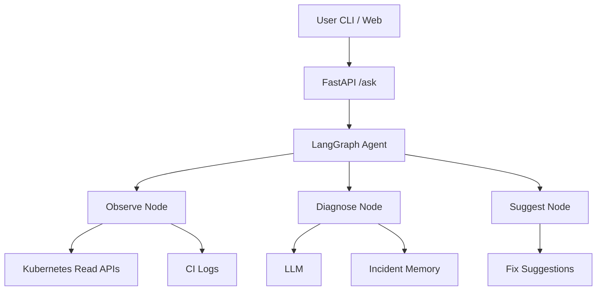
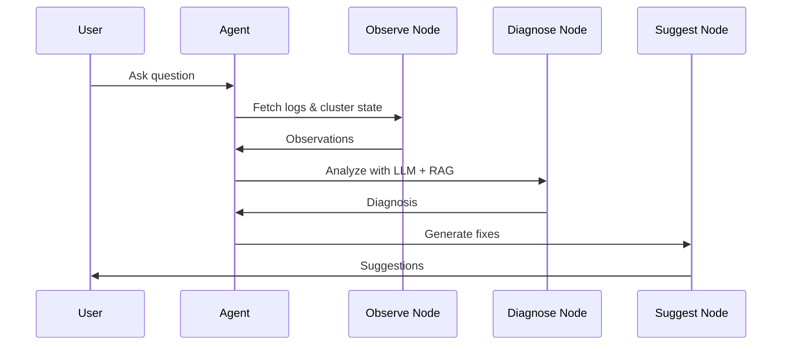

# 🤖 DevOps AI Agent

A **local-first, open-source AI agent for DevOps** that diagnoses Kubernetes and CI/CD failures using **real logs, cluster state, LLM reasoning, and retrieval-augmented generation (RAG)**.

> Built for DevOps engineers who want **signal, not chatbots**.

---

## 🚀 What This Project Does

This agent acts like a **junior SRE that never sleeps**:

* 🔍 Observes real infrastructure (Kubernetes, CI logs)
* 🧠 Diagnoses failures using LLM reasoning + past incidents
* 🛠️ Suggests exact fixes (commands, YAML, config changes)
* 🧱 Stays **read-only and safe by default**

❌ No auto-apply
❌ No destructive commands
❌ No cloud lock-in

---

## 🎯 MVP Scope

### ✅ Included

* Kubernetes failure diagnosis (CrashLoopBackOff, OOM, ImagePull, etc.)
* GitHub Actions CI failure analysis
* Incident memory using vector search (Chroma)
* CLI + REST API interface
* Docker-based one-command setup

### 🚫 Not Included (Yet)

* Auto-remediation
* Terraform apply
* Production mutations

---

## 🧠 High-Level Architecture



---

## 🧩 Agent Flow (Stateful Reasoning)



---

## 📁 Repository Structure

The repository includes **realistic sample data** so the agent works out-of-the-box and RAG is immediately effective.

```
devops-ai-agent/
├── api/
│   └── main.py                # FastAPI entrypoint
├── agent/
│   ├── graph.py               # LangGraph wiring
│   ├── state.py               # Shared agent state
│   ├── nodes/
│   │   ├── observe.py         # Fetch logs / cluster state
│   │   ├── diagnose.py        # LLM + RAG reasoning
│   │   └── suggest.py         # Fix generation
│   ├── tools/
│   │   ├── kubernetes.py      # Safe kubectl wrapper (read-only)
│   │   ├── github.py          # GitHub Actions log fetcher
│   │   └── terraform.py       # Terraform error parser
│   └── memory/
│       ├── chroma.py          # Vector store init
│       └── ingest.py          # Runbook + incident ingestion
├── data/
│   ├── runbooks/              # Operational knowledge (RAG)
│   │   ├── eks-oomkill.md
│   │   ├── imagepullbackoff.md
│   │   └── terraform-iam-deny.md
│   ├── incidents/             # Historical incidents
│   │   ├── 2024-11-eks-oom.json
│   │   ├── 2024-12-tf-apply-fail.json
│   │   └── 2025-01-ci-permission.json
│   ├── logs/                  # Sample logs for local demo
│   │   ├── kubernetes/
│   │   │   └── payments-api.log
│   │   └── github-actions/
│   │       └── terraform-failure.log
│   └── eval/                  # Evaluation datasets
│       ├── golden_incidents.json
│       └── expected_outputs.json
├── ui/
│   └── cli.py                 # Interactive CLI
├── docs/
│   ├── screenshots/
│   └── demo/
│       └── devops-agent-demo.gif
├── docker-compose.yml
├── requirements.txt
├── .env.example
└── README.md
```

---

## 🛠️ Tech Stack

### Cloud-Native Focus (AWS + Kubernetes + Terraform)

This MVP is **explicitly tailored** for real-world AWS-based DevOps environments.

| Layer         | Technology           | Usage                        |
| ------------- | -------------------- | ---------------------------- |
| Cloud         | AWS                  | EKS, CloudWatch, IAM         |
| IaC           | Terraform            | Drift + failure analysis     |
| Containers    | Kubernetes           | Pod, Node, Event diagnostics |
| CI/CD         | GitHub Actions       | Terraform & deploy failures  |
| Observability | CloudWatch / kubectl | Logs & metrics               |
| Agent         | LangGraph            | Stateful reasoning           |
| Memory        | ChromaDB             | Incident + runbook RAG       |

| Layer        | Technology                 |
| ------------ | -------------------------- |
| Language     | Python 3.11                |
| API          | FastAPI                    |
| Agent        | LangGraph                  |
| LLM          | OpenAI / LLaMA (pluggable) |
| Memory       | ChromaDB                   |
| Infra Access | kubectl, GitHub API        |
| Runtime      | Docker Compose             |

---

## 🔐 Safety Model

The agent is **read-only by design**.

### Allowed

* `kubectl get`
* `kubectl describe`
* `kubectl logs`
* GitHub Actions log reads

### Blocked

* `kubectl apply`
* `kubectl delete`
* `terraform apply`

```yaml
policy:
  allow:
    - kubectl get
    - kubectl describe
    - kubectl logs
  deny:
    - kubectl apply
    - kubectl delete
```

---

## 📸 Screenshots & Demo Flow

> Screenshots and GIFs make this project instantly understandable to reviewers and recruiters.

### 1️⃣ CLI Diagnosis Demo

**Scenario:** Kubernetes pod stuck in `CrashLoopBackOff`

```
DevOps Agent > Why is pod payments-api crashing in prod?
```

*Output:*

* Detected OOMKill from container logs
* Suggested memory limit update
* Referenced similar past incident

📷 *Screenshot placeholder:* `docs/screenshots/cli-k8s-diagnosis.png`

---

### 2️⃣ GitHub Actions Failure Analysis

**Scenario:** Terraform apply failed in CI

Agent:

* Parses GitHub Actions logs
* Identifies missing variable / IAM permission
* Suggests Terraform fix (no apply)

📷 *Screenshot placeholder:* `docs/screenshots/github-actions-failure.png`

---

### 3️⃣ End-to-End Demo GIF

📽️ **Recommended GIF flow:**

1. Ask question in CLI
2. Agent fetches logs
3. Diagnosis + suggestions returned

📁 `docs/demo/devops-agent-demo.gif`

---

## 🚦 Getting Started

### 1️⃣ Prerequisites

* Docker + Docker Compose
* kubectl configured (read-only is fine)
* OpenAI API key (or local LLM)

### 2️⃣ Clone & Configure

```bash
git clone https://github.com/yourname/devops-ai-agent.git
cd devops-ai-agent
cp .env.example .env
```

Edit `.env`:

```env
OPENAI_API_KEY=sk-xxxx
```

### 3️⃣ Run

```bash
docker compose up --build
```

API will be available at:

```
http://localhost:8000
```

---

## 💬 Using the CLI

```bash
python ui/cli.py
```

Example questions:

* "Why is pod payments-api crashing?"
* "Why did my GitHub Action fail after Terraform apply?"
* "What caused the last deployment rollback?"

---

## 🧪 Example Output

```json
{
  "diagnosis": "The pod is in CrashLoopBackOff due to an OOMKill",
  "suggestions": [
    "Increase memory limits to 512Mi",
    "Check for memory leaks in startup",
    "Verify JVM heap configuration"
  ]
}
```

---

## 🧠 Incident Memory (RAG)

The agent uses **Retrieval-Augmented Generation** to ground answers in **real operational knowledge**.

### What Goes Into Memory

* Incident reports
* Postmortems
* Terraform failure notes
* Kubernetes runbooks

### Example Runbook (Markdown)

```
# Incident: EKS Pod OOMKill

## Symptoms
- Pod enters CrashLoopBackOff
- Exit code 137

## Root Cause
Container memory limit too low for workload spike.

## Resolution
- Increase memory limit from 256Mi → 512Mi
- Monitor via CloudWatch Container Insights
```

Stored in:

```
data/runbooks/eks-oomkill.md
```

This allows the agent to say:

> "This issue matches a previous EKS OOMKill incident."

The agent stores:

* Past incidents
* Runbooks
* Postmortems

This allows it to say:

> “This looks similar to incident #42 from last month.”

---

## 🧪 Evaluation & Hallucination Detection

LLMs can hallucinate. This project **measures and limits that risk**.

### Evaluation Metrics (MVP)

| Metric          | Description                        |
| --------------- | ---------------------------------- |
| Tool Grounding  | % of answers backed by tool output |
| Log Citation    | Did response reference real logs?  |
| Confidence Flag | Warn if unsure                     |
| Reproducibility | Same input → same diagnosis        |

### Example Hallucination Guard

```python
if not observations:
    return "⚠️ Insufficient data. Unable to diagnose safely."
```

### LLM Self-Check Prompt

```
If you are unsure or lack evidence, say so explicitly.
Do NOT guess.
```

### Future Metrics

* Golden incident test set
* Human-in-the-loop validation
* Precision / recall on known failures

---

## 📈 Why This Project Matters

This is **not a chatbot**.

It demonstrates:

* Real DevOps tool integration
* Safe AI agent design
* Stateful reasoning with LangGraph
* Production-minded guardrails

Perfect as a **portfolio flagship** for:

* DevOps Engineers
* SREs
* Platform Engineers
* AI Infra Engineers

---

## 🛣️ Roadmap

* [ ] Terraform drift analysis
* [ ] Auto PR creation for fixes
* [ ] Slack bot interface
* [ ] Multi-agent (Observer / Diagnoser / Executor)
* [ ] Evaluation & hallucination metrics

---

## 🤝 Contributing

PRs welcome. Ideas especially encouraged around:

* New tools
* Better prompts
* Additional integrations

---

## 📄 License

Apache License 2.0

---

## ⭐ Final Note

If you’ve ever thought:

> “I wish Kubernetes errors explained themselves…”

This project is for you 🚀
